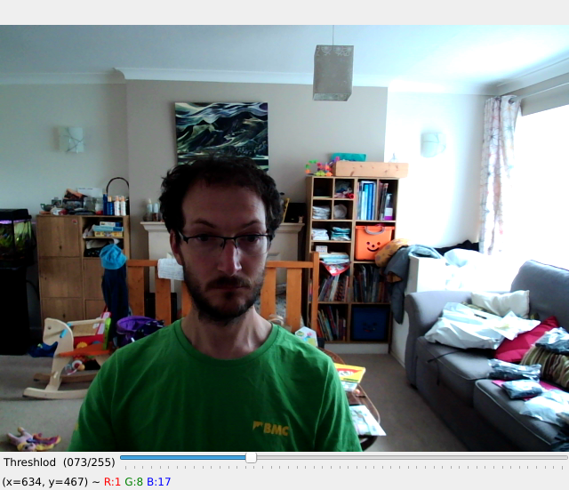
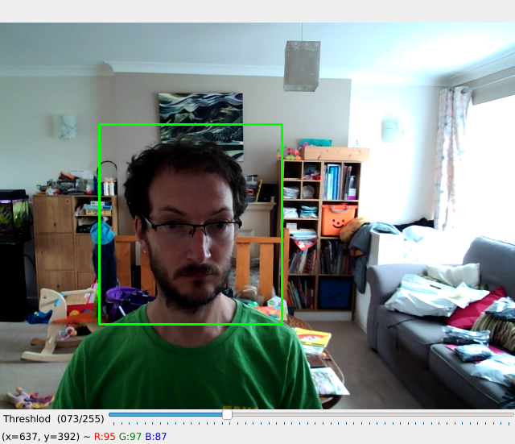
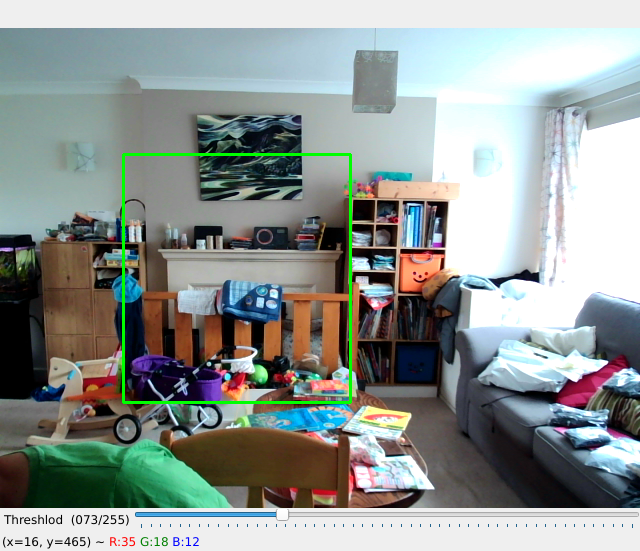
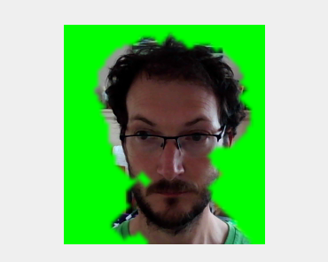
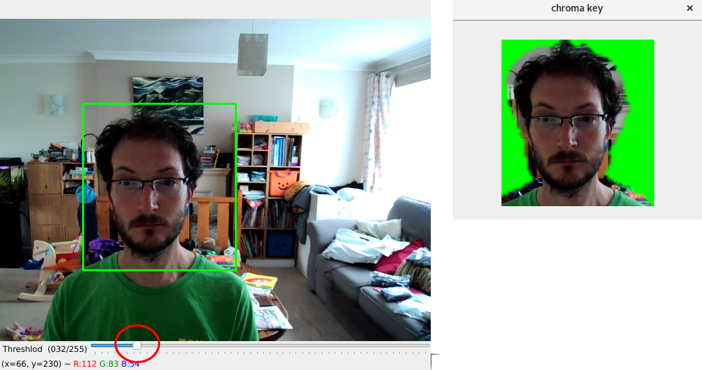
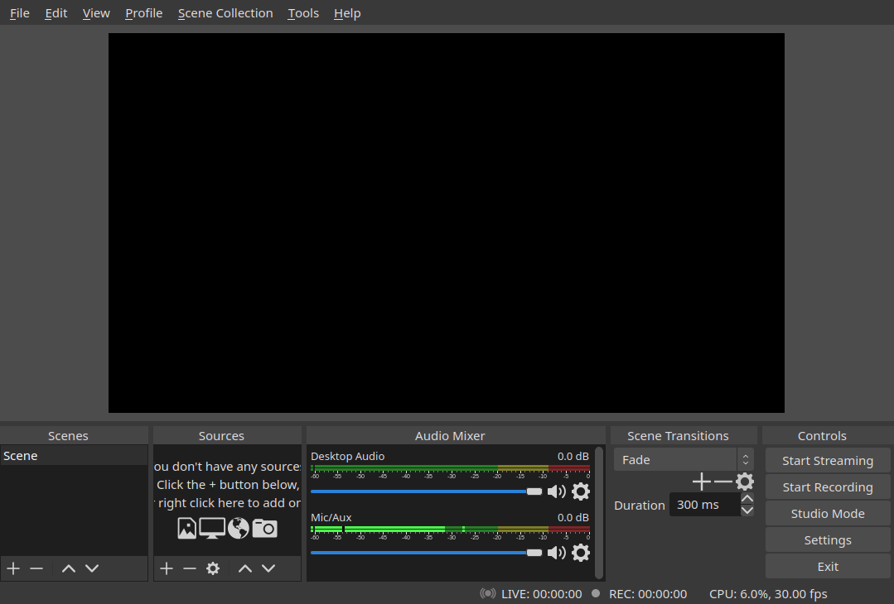
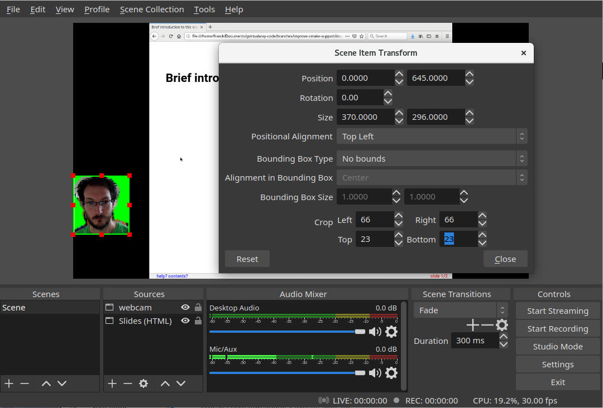
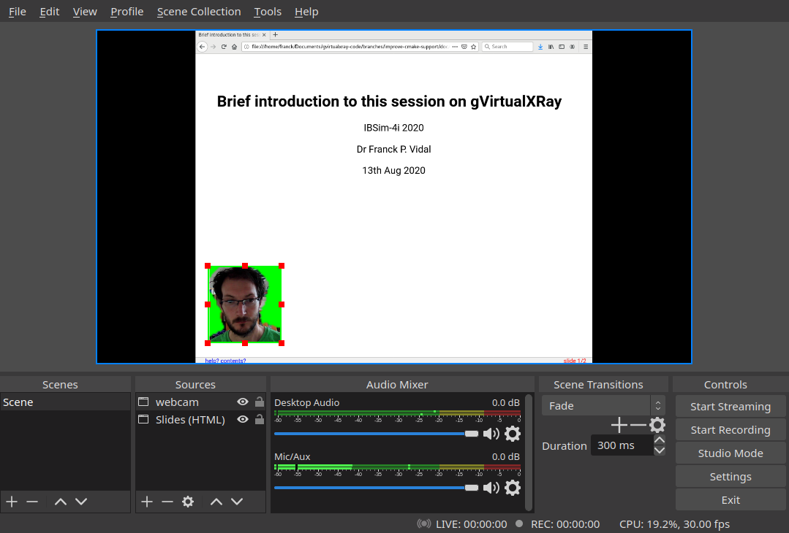
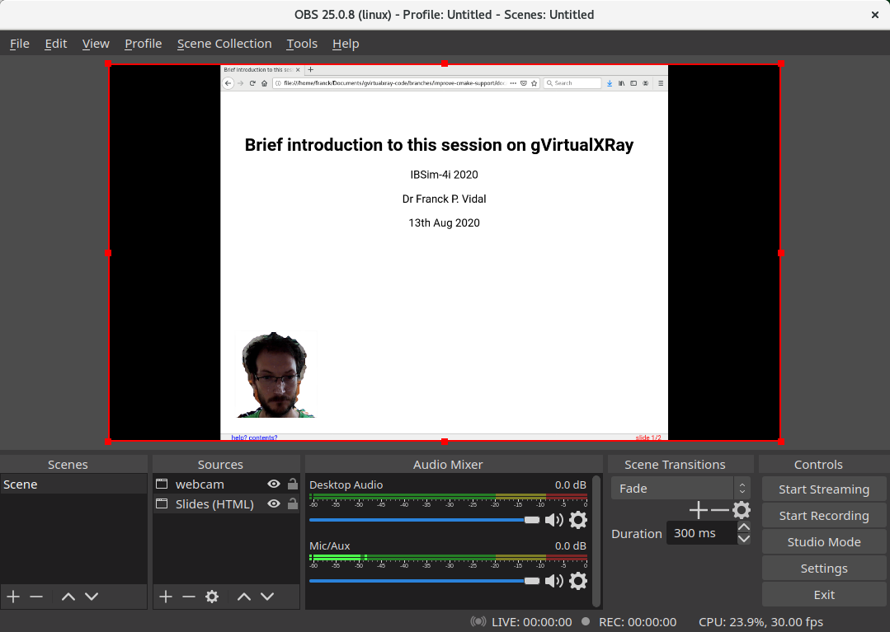

# backSub4Lectures
The program I use to perform background subtraction to include my face over the slides in the [Open Broadcaster Software (OBS)](https://obsproject.com/).

Using [Chroma key compositing](https://en.wikipedia.org/wiki/Chroma_key) in [OBS](https://obsproject.com/), and a bed sheet as a coloured screen behind me, did not do the job. As a software developer keen on Copmuter Vision (CV), I decided to write my own tool based on [OpenCV](https://opencv.org/) and [Python](https://www.python.org/) to perform some background subtraction using a webcam, and replace the background with a uniform colour, e.g. green.


## Requirements:

Install the requirements if needed using:

```bash
$ python3 -m pip install --user numpy
$ python3 -m pip install --user opencv-python
```

(note: you may omit the `--user` option in the commands above)

## Usage:

```bash
backSub4Lectures.py [-h] [--ROI ROI ROI ROI ROI]
                           [--colour COLOUR COLOUR COLOUR]

Background subtraction to use with Chroma key.

optional arguments:
  -h, --help            show this help message and exit
  --ROI ROI ROI ROI ROI
                        Corners of the region of interests.
  --colour COLOUR COLOUR COLOUR
                        Replace the backbround with this RGB colour (0 0 0 is
                        black, 255 255 255 is white), useful for chroma key.
```

## Example:

- Run the tool.


- Click-n-drag to select a region of interest (ROI).



- Hide under your desk and press `b` to initialise the background.



A new window will open.



- Adjust the slider if needed.



- If you want, you can adjust the ROI in the main window at any time.
- Keep the program running and launch OBS.



- Add some content. I will add a new `Window Capture (Xcomposite)` and select my web browser where my slides are, but you can do what ever you'd like.

- Add a new source `Window Capture (Xcomposite)` again. This time choose the window called `chroma key` and validate your choice.

- Do a right click on this source and edit the transform to crop the image and remove the window's borders.



- Move this source over the slides to integrate it.



- Add the chroma key filter. Green wasn't a good choice of background colour as it is too close to my tee-shirt's colour.

- Stop `backSub4Lectures.py`, note the ROI corners, and restart it with another colour of your choice if needed. I'll use magenta (255, 0, 255)

```
$ ./backSub4Lectures.py
ROI: [(123, 126), (350, 374)]

$./backSub4Lectures.py --ROI 123 126 350 374 --colour 255 0 255
```


- Edit the chroma key filter so that magenta is the colour that is filtered out. Voila.


